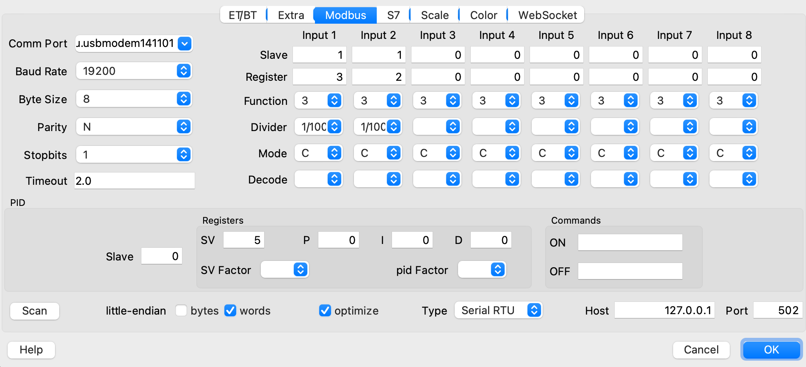

# Roasting coffee PID controlled using artisan
## Hardware
- Coffee Roaster (electrically heated pan with an arm to move the beans)
- MAX6675 Thermoelement 
- Thermo Sensor 100mm Spade K-Typ Thermoelement (connected inside the body to the metal of the pan)
- Arduini Uno (or any other Arduino)
- SSR-40DA 40A Solid State Relay Input 3-32V DC Output 24-380V AC (did not have a smaller one, but works FINE)
  
## Software 
Artisan:
https://github.com/artisan-roaster-scope/artisan/releases/tag/v1.5.0


The slightly modified sketch from https://github.com/lukeinator42/coffee-roaster/blob/master/sketch/sketch.ino:

```
// Infrared
#include <Adafruit_MLX90614.h>
// Thermoc.
#include <max6675.h>

#include <Wire.h>
#include <ModbusRtu.h>

// data array for modbus network sharing
uint16_t au16data[16] = {
  0, 0, 0, 0, 0, 0, 0, 0, 0, 0, 0, 0, 0, 0, 1, -1 };

/**
 *  Modbus object declaration
 *  u8id : node id = 0 for master, = 1..247 for slave
 *  u8serno : serial port (use 0 for Serial)
 *  u8txenpin : 0 for RS-232 and USB-FTDI 
 *               or any pin number > 1 for RS-485
 */
Modbus slave(1,0,0); // this is slave @1 and RS-232 or USB-FTDI

int thermoSO = 4;
int thermoCS = 5;
int thermoSCK = 6;

int tc_temp;

Adafruit_MLX90614 mlx = Adafruit_MLX90614();
MAX6675 thermocouple(thermoSCK, thermoCS, thermoSO);

int led = 2;
int tc_relay  = 10; 

int tc_relay_offset = 30;  //C*100 

void setup() {
  slave.begin(19200); 
  mlx.begin();
  
  // use Arduino pins 
  pinMode(led, OUTPUT);
  pinMode(tc_relay, OUTPUT);
  
  delay(500);
}

void loop() {

   tc_temp  = (uint16_t) (thermocouple.readCelsius()*100+tc_relay_offset*100);
   au16data[2] = tc_temp;

    
    //Serial.print(au16data[2]); Serial.println("*C thc");

   //poll modbus registers
   slave.poll( au16data, 16 );

   //write relay value using pwm
   analogWrite(led,       (au16data[4]/10.0)*255);
   analogWrite(tc_relay,  (au16data[4]/100.0)*255);
   
   delay(500);
}
```
Pin 9 of the Arduino switches the Solid State Relay which switches on and off the circuit depending on the temperature messured.

Using PID settings: P=7, I=0.14, D=94
<br>


## Experiences
I usually rost 333 kg ( 1kg/3 :) ) at once and it takes 25-28 minutes, depending on the grade I want.

<br>
I use Artisan (https://artisan-scope.org/) to PID-Control the process.

## Some important artisan settings I use  
Background profile:<br>

<br>
Config ports:<br>

<br>
Config device:<br>

<br>
Config events:<br>

<br>
PID control:<br>

<br>

## Using a drum roaster for up to 1 kg at once. 
temperature_only.py just measures the temperature and compares it to a profile graph. For manual controling when roasting with gas.  

